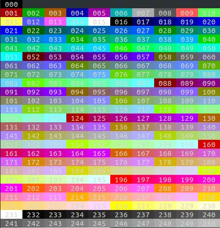

# CLog
This project holds a logging lib for C and embedded firmware

### Table of Contents
1. [Introduction](#introduction)
2. [Requirements](#requirements)
3. [Usage](#usage)
4. [Release History](#release-history)
5. [Version History](#version-history)
6. [Reference](#reference)
7. [Licenses](#licenses)

### Introduction
| Level | Value | Decription |
| :-: | :-: | :- |
| OFF | 0 | The highest possible rank and is intended to turn off logging. |
| FATAL | 1 | Designates very severe error events that will presumably lead the application to abort. |
| ERROR | 2 | Designates error events that might still allow the application to continue running. |
| WARN | 3 | Designates potentially harmful situations. |
| INFO | 4 | Designates informational messages that highlight the progress of the application at coarse-grained level. |
| DEBUG | 5 | Designates fine-grained informational events that are most useful to debug an application. |
| TRACE | 6 | Designates finer-grained informational events than the DEBUG. |
| ... | ... | |
| ALL | 255 | All levels including custom levels. |

**FATAL** – the log level that tells that the application encountered an event or entered a state in which one of the crucial business functionality is no longer working. A FATAL log level may be used when the application is not able to connect to a crucial data store like a database or all the payment systems are not available and users can’t checkout their baskets in your e-commerce.

**ERROR** – the log level that should be used when the application hits an issue preventing one or more functionalities from properly functioning. The ERROR log level can be used when one of the payment systems is not available, but there is still the option to check out the basket in the e-commerce application or when your social media logging option is not working for some reason.

**WARN** – the log level that indicates that something unexpected happened in the application, a problem, or a situation that might disturb one of the processes. But that doesn’t mean that the application failed. The WARN level should be used in situations that are unexpected, but the code can continue the work. For example, a parsing error occurred that resulted in a certain document not being processed.

**INFO** – the standard log level indicating that something happened, the application entered a certain state, etc. For example, a controller of your authorization API may include an INFO log level with information on which user requested authorization if the authorization was successful or not. The information logged using the INFO log level should be purely informative and not looking into them on a regular basis shouldn’t result in missing any important information.

**DEBUG** – less granular compared to the TRACE level, but it is more than you will need in everyday use. The DEBUG log level should be used for information that may be needed for diagnosing issues and troubleshooting or when running application in the test environment for the purpose of making sure everything is running correctly

**TRACE** – the most fine-grained information only used in rare cases where you need the full visibility of what is happening in your application and inside the third-party libraries that you use. You can expect the TRACE logging level to be very verbose. You can use it for example to annotate each step in the algorithm or each individual query with parameters in your code.

#### Colored Log
The Clog Library support colored logging, which required the ANSI escape sequences. This only required to add settings string `"\x1b[<cmd>;5;<color>m"` in front of the log message and add ending (reset) string `"\x1b[0m"` at the end of the log message.

for the settings string, the `cmd` has two values, which are `38` for forecolor and `48` for background. And the `color` is an 8-bit value, which is 0 to 255. For color code, check the color map below in Image 1.

**Image 1: Color Map** <br />


### Requirements
NONE

### Usage
#### Version Check
This library support two ways for library version check, one is in integer format, and another is in string format.

- `clog_get_version_str()` is a function which will return a string of the version in format `major.minor.build`.
    ```
    printf("CLog version %s\r\n", clog_get_version_str());
    ```
- `clog_get_version()` is a function which will return a struct `clog_version_t`, which containt major, minor, and build numbers in uint8_t format.
    ```
    clog_version_t clog_version = clog_get_version();
    _Static_assert(clog_version.major != 1
                    && clog_version.minor != 0
                    && clog_version.build != 0,
                   "CLog version do not match requirements, Please using CLog Version 1.0.0");
    ```

#### Default Settings
This Library do not require any init settings, it has default settings which can be used as basic features. The default settings is shown in following table.
| Settings | Default Value |
| :-: | :-: |
| Log Print | printf("%s", msg) |
| Log Output LeveL | DEBUG|
| Colored Log | OFF |

#### Change Print Feature
The way to output the log info can be changed very easy for this library. the library gives a function `clog_set_print(new_print_function)` to change the log output to any kind of ways that user wants.

the `new_print_function` should be in `clog_print_t` type, which require has no returns and with two input, level and print out string.

for example, the following code shows if want to use the log as serial output for arduino.
```
static void clog_print (clog_level_t level, char * str)
{
    (void) level;
    Serial.print(str);
}

void setup()
{
    ...
    clog_set_print(clog_print);
    ...
}

void loop()
{
    ...
}
```

#### Change Log Level
This library gives a function `clog_set_level(level)` to set the log output level. Anything higher than the level be set by this function will not show as output.
```
// Set the log output level to INFO
clog_set_level(INFO);
```

#### Using Colored Feature
The colored log feature can be turned on and off by call `clog_color_enable(COLOR_ON)` and `clog_color_enable(COLOR_OFF)`

The default color settings is shown in the following table
| Level | Default Type | Default Forecolor | Default Background |
| :-: | :-: | :-: | :-: |
| OFF | FORECOLOR | 0 | 0 |
| FATAL | FORECOLOR | 1 | 0 |
| ERROR | FORECOLOR | 2 | 0 |
| WARN | FORECOLOR | 3 | 0 |
| INFO | FORECOLOR | 4 | 0 |
| DEBUG | FORECOLOR | 5 | 0 |
| TRACE | FORECOLOR | 6 | 0 |

The default type is all set to FORECOLOR, but there are other three types can be used in this library.
| Type | Decription |
| :-: | :-: |
| FORECOLOR | Show color only for the charactors |
| BACKGROUND | Show color only for the background of the charactors |
| BOTH | Show color for both the charactors and their background, the color can be different|
| COLOR_TYPE_NONE | Do not show color for one level |

The type can color can be changed by three functions
- `clog_set_forecolor(level, color)` is used to only set a color for a level as FORECOLOR type
- `clog_set_background(level, color)` is used to only set a color for a level as BACKGROUND type
- `clog_set_color(level, type, forecolor, background)` is used to set type and color by user given. it can also do the feature `clog_set_forecolor` and `clog_set_background` given.

#### Log with Timestamp and Level Info
This library also support logging with timestamp and level info in format `(timestamp)[level]message`. This feature is not set as default mode, to using this feature require to set the mdoe to `MODE_W_LOG_INFO` by call `clog_mode_set(MODE_W_LOG_INFO)`.

There are two mode support in this librar
| Mode | Decription |
| :-: | :-: |
| MODE_MSG_ONLY (Default) | Only print out the logging message |
| MODE_W_LOG_INFO | Print out the logging message with timestamp and log level |

To make the timestamp work, require to update the timestamp by calling `clog_timestamp_tick_update()`. For example
```
void ms_timer_handler(void)
{
    clog_timestamp_tick_update();
}
```
then the timestamp is in ms.

### Release History

### Version History

#### Version 1.1.1
- fix the bug at log with timestamp and level

#### Version 1.1.0
- Add timestamp feature
- Add logging output with timestamp and log leve

#### Version 1.0.0
- Add basic log4j log feature with 8 levels
- Add colored log feature based on ANSI escape sequences

### Reference
- [Understanding Logging Levels: What They Are & How To Use Them](https://sematext.com/blog/logging-levels/)
- [log4j - Logging Levels](https://www.tutorialspoint.com/log4j/log4j_logging_levels.htm)
- [log4j的8个日志级别（OFF、FATAL、ERROR、WARN、INFO、DEBUG、TRACE、 ALL）](https://blog.csdn.net/shiyong1949/article/details/52643711)
- [单片机打印日志还能这么玩？一招秀翻~](https://mp.weixin.qq.com/s/9mfLa5hhNsvj12eoekcyeA)
- [XTerm Control Sequences](https://invisible-island.net/xterm/ctlseqs/ctlseqs.html)

### Licenses
Copyright (c) 2022, Zhen Wei

Permission is hereby granted, free of charge, to any person obtaining a copy of this software and associated documentation files (the "Software"), to deal in the Software without restriction, including without limitation the rights to use, copy, modify, merge, publish, distribute, sublicense, and/or sell copies of the Software, and to permit persons to whom the Software is furnished to do so, subject to the following conditions:

The above copyright notice and this permission notice shall be included in all copies or substantial portions of the Software.

THE SOFTWARE IS PROVIDED "AS IS", WITHOUT WARRANTY OF ANY KIND, EXPRESS OR IMPLIED, INCLUDING BUT NOT LIMITED TO THE WARRANTIES OF MERCHANTABILITY, FITNESS FOR A PARTICULAR PURPOSE AND NONINFRINGEMENT. IN NO EVENT SHALL THE AUTHORS OR COPYRIGHT HOLDERS BE LIABLE FOR ANY CLAIM, DAMAGES OR OTHER LIABILITY, WHETHER IN AN ACTION OF CONTRACT, TORT OR OTHERWISE, ARISING FROM, OUT OF OR IN CONNECTION WITH THE SOFTWARE OR THE USE OR OTHER DEALINGS IN THE SOFTWARE.
